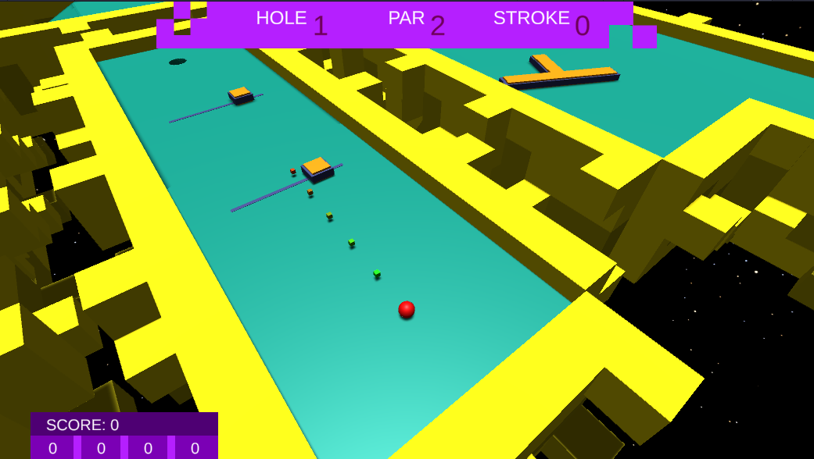

# This is the old version of this game, check out the new version with multiplayer functionality! https://github.com/berkeparildar/Putt-Time

# Putt Time

Putt Time is a 3D singleplayer golf game heavily inspired by Discord's Putt Party. This game tests your precision and skill in four different courses, each with its own unique layout and obstacles.

## Gameplay
- Shooting the Ball: To shoot the ball, aim using the mouse and drag it to set the power of your shot. The longer you drag the mouse, the more power your shot will have. Pay attention to the direction, as it rotates faster with more power.
 

- Obstacles: Each course is filled with various obstacles that will put your skills to the test. From moving or rotating platforms, you'll need to carefully time your shots and make calculations to overcome these challenges.
 

- Jump Mechanic: On certain holes, you'll encounter special platforms that can launch your ball into the air. Utilize the jump mechanic by shooting towards the jump pads with the correct amount of power to pass the gaps in the courses.
 

- Score: Your score is determined by the number of shots it takes you to complete each hole. Strive for a low score and aim to get a hole-in-one whenever possible.

